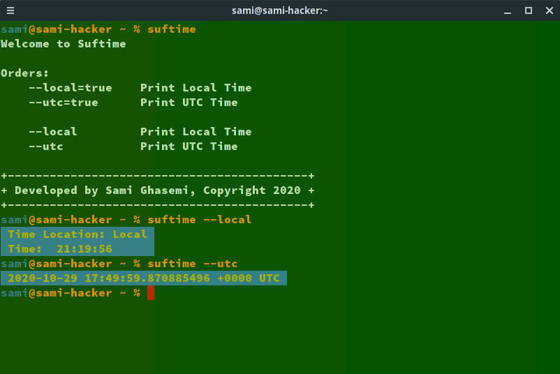

# suftime
<strong>Simple Clock</strong>

# Install on GNU/Linux Dirtros 
<b>Please Following Commands</b>

`cd suftime/product`

`sh install.sh`

<b>Test Installation</b>

`suftime`

# Orders

suftime --local=true

suftime --utc=true

suftime --local

suftime --utc

