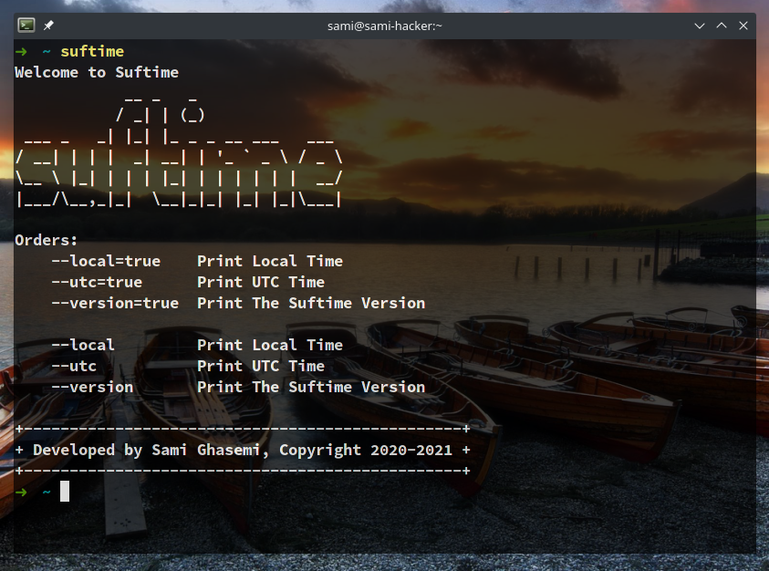

# suftime

<div>
  
  
  <a href="https://golang.org/">
    
  </a>
  <a href="https://github.com/sami2020pro/suftime/blob/main/LICENSE">
    
  </a>
</div>

<strong>Simple Clock</strong>



# Install on GNU/Linux Distros 
<b>Please Following Commands</b>

```shell
make

make compile

sudo make install
```

<b>Test Installation</b>

```shell
suftime
```

# Orders

<ul>
  <li><p>suftime --local=true</p></li>
  <li><p>suftime --utc=true</p></li>
  <li><p>suftime --version=true</p></li>

  <li><p>suftime --local</p></li>
  <li><p>suftime --utc</p></li>
  <li><p>suftime --version</p></li>
</ul>

# Contact Way
<strong>Gmail</strong>

<b>samprogram2007@gmail.com</b>

<!-- 2020-2021 -->
